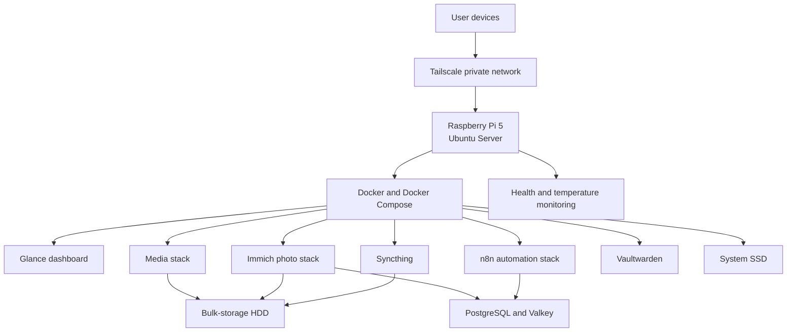
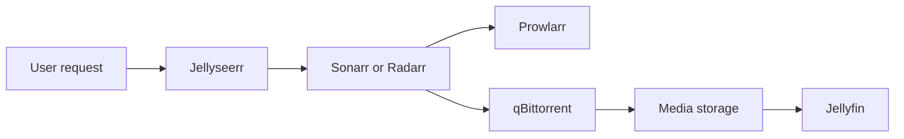

# Home Server Infrastructure

**Last audited:** October 5, 2026

This repository documents how my Raspberry Pi home server is organized, how its services work together, and where application data is stored.

## Overview

The server is a **Raspberry Pi 5 with 8 GB of RAM** running **Ubuntu 24.04 LTS**. Docker and Docker Compose are used to run most applications as isolated containers.

The infrastructure is divided into five main layers:

1. **Hardware** — Raspberry Pi, system SSD, and bulk-storage HDD.
2. **Operating system** — Ubuntu Server and host-level services.
3. **Private access** — Tailscale and SSH for administration.
4. **Application platform** — Docker and separate Compose stacks.
5. **Data and monitoring** — persistent storage, databases, health checks, and SSD temperature monitoring.



## Hardware Layout

| Component | Role |
| --- | --- |
| Raspberry Pi 5 | Runs Ubuntu, Docker, networking, and monitoring services |
| 4-core ARM64 processor | Handles application and container workloads |
| 8 GB RAM | Shared between the operating system and containers |
| Approximately 256 GB SSD | Stores Ubuntu, Docker, application configuration, and databases |
| Approximately 500 GB HDD | Stores larger media, photo, and synchronized files |

The SSD is the primary boot and application drive. Its usage was approximately **29%** during the latest audit. The HDD provides additional capacity for data that does not need SSD-level performance.

## Host Operating System

The base system runs:

| Component | Version or purpose |
| --- | --- |
| Ubuntu Server | Ubuntu 24.04.4 LTS |
| Linux kernel | Raspberry Pi Linux 6.8.0 build |
| CPU architecture | ARM64 / `aarch64` |
| Docker Engine | Version 29.8 |
| Docker Compose | Version 5.5 |
| Tailscale | Private networking between approved devices |
| SSH | Command-line administration through the private network |

Ubuntu manages hardware, storage, networking, Docker, and system services. Applications are kept inside containers instead of being installed directly on the host whenever possible.

## How Applications Are Organized

Applications are separated into Docker Compose stacks. Each stack contains services that belong together and normally has its own Docker network and persistent data directories.

This structure provides several benefits:

- One application can be restarted without restarting the entire server.
- Dependencies from different applications do not conflict.
- Application configuration can be backed up separately.
- A broken update is easier to isolate and roll back.
- Services within a stack can communicate using Docker networking.

The server had **19 running containers** during the latest audit.

## Dashboard

### Glance

Glance provides a simple homepage for viewing links and useful server information from one place. It acts as the entry point to the other self-hosted applications.

```text
User device
    |
Tailscale
    |
Glance dashboard
    |
Other self-hosted services
```

## Media Stack

The media services are connected as a workflow rather than operating independently.

| Service | Role |
| --- | --- |
| Jellyfin | Plays and organizes the final media library |
| Jellyseerr | Provides a user-friendly interface for requesting content |
| Sonarr | Manages television-series downloads and organization |
| Radarr | Manages movie downloads and organization |
| Bazarr | Finds and manages subtitles |
| Prowlarr | Manages indexer connections for Sonarr and Radarr |
| qBittorrent | Handles downloads requested by the management services |
| FlareSolverr | Supports compatible indexer access when required |
| Plezy Relay | Provides an additional supporting relay service |

### Media request flow



A request begins in Jellyseerr. Sonarr or Radarr processes it, Prowlarr helps locate a suitable source, and qBittorrent downloads the file. The completed file is organized on bulk storage and then made available through Jellyfin. Bazarr handles subtitles separately.

## Photo Management Stack

Immich provides private photo and video management. Its components are separated by responsibility:

| Service | Role |
| --- | --- |
| Immich Server | Main web interface and application API |
| Immich Machine Learning | Facial recognition and intelligent search processing |
| Immich PostgreSQL | Stores application metadata |
| Valkey | Provides caching and background-job coordination |

```text
User uploads photo
        |
        v
Immich Server
   |          |
   v          v
PostgreSQL   Valkey
   |
   v
Photo storage
   |
   v
Machine-learning processing
```

The database stores metadata, while the original photo and video files are kept on persistent storage. Machine-learning work runs in its own container so it can be managed independently from the main server.

## Automation Stack

n8n runs automated workflows and integrations.

| Service | Role |
| --- | --- |
| n8n | Workflow editor, scheduler, and execution service |
| n8n Task Runner | Executes supported workflow tasks separately |
| PostgreSQL | Stores workflows, execution history, and application data |

```text
Trigger or schedule
       |
       v
      n8n
   |       |
   v       v
Task Runner  PostgreSQL
```

Keeping the task runner and database separate makes the automation platform easier to maintain and allows each component to have a focused role.

## File Synchronization

Syncthing synchronizes selected files between approved devices. It provides direct device-to-device synchronization without requiring a third-party storage provider for every transfer.

Its configuration remains on persistent storage so device relationships and synchronization settings survive container replacement.

## Password Management

Vaultwarden provides a lightweight, self-hosted password-vault service compatible with Bitwarden clients.

The application runs in its own container and stores its persistent vault data separately from the container image. The container can therefore be upgraded or recreated without deleting its stored data.

## Docker Networking

Docker networks separate application groups from one another.

For example:

- Media-management services share a network so they can communicate internally.
- Immich services share a dedicated network with their database and cache.
- n8n connects to its task runner and database through application networks.
- Unrelated applications do not need to share the same internal network.

Containers refer to one another using service names instead of fixed container addresses. Docker handles the internal service discovery.

## Storage Structure

Persistent data is divided by purpose:

### System SSD

The SSD contains:

- Ubuntu Server
- Docker and container images
- Application configuration
- Databases
- Frequently accessed application data
- Logs and system packages

### Bulk-storage HDD

The HDD contains larger files such as:

- Media libraries
- Photo and video files
- Downloaded content
- Synchronized files

Container images are replaceable, but configuration, databases, and user files are not. Those persistent data categories require backups.

## Private Access

Tailscale connects approved devices to the server through a private network. SSH and administrative web interfaces can be accessed through this private connection.

The general access path is:

```text
Approved device
      |
      v
Tailscale private network
      |
      v
Raspberry Pi server
      |
      v
Docker application
```

This approach avoids making administrative access directly dependent on the local network and reduces the need to expose management services publicly.

## Monitoring

The server currently uses several lightweight monitoring methods:

- Docker reports whether containers are running.
- Supported containers provide health-check results.
- A user service monitors SSD temperature.
- Storage usage is checked during infrastructure audits.
- System and container updates are reviewed as part of maintenance.

During the latest audit:

| Check | Result |
| --- | --- |
| Docker | Active |
| Tailscale | Active |
| SSH | Active |
| SSD temperature monitor | Active |
| Containers | 19 running |
| Configured container health checks | Healthy |
| System SSD usage | 29% |
| Ubuntu package updates | Pending review |

## Maintenance Workflow

Regular maintenance includes:

1. Check that important containers are running and healthy.
2. Review available Ubuntu security updates.
3. Review container-image updates and release notes.
4. Check storage usage and disk health.
5. Confirm that the SSD temperature monitor is active.
6. Back up application configuration and databases.
7. Test that important backups can actually be restored.
8. Remove unused images and volumes only after confirming they are unnecessary.

## Recovery Model

This is a single-server setup rather than a high-availability cluster. If the Raspberry Pi, system SSD, or operating system fails, multiple applications may become unavailable together.

Recovery therefore depends on preserving:

- Docker Compose definitions
- Environment configuration and secrets
- Application configuration directories
- PostgreSQL database backups
- Vaultwarden data
- Important photo, media, and synchronized files

With those items available, the operating system and Docker can be reinstalled, the application stacks recreated, and persistent data restored.

## Design Principles

The infrastructure follows a few simple principles:

- **Containerize applications** to keep dependencies isolated.
- **Separate services by stack** so each application can be managed independently.
- **Use private networking** for administration.
- **Separate bulk files from system data** to use storage efficiently.
- **Keep application data persistent** even when containers are replaced.
- **Monitor basic health and temperature** without requiring a heavy monitoring platform.
- **Document how components connect** so the system can be maintained and rebuilt later.
