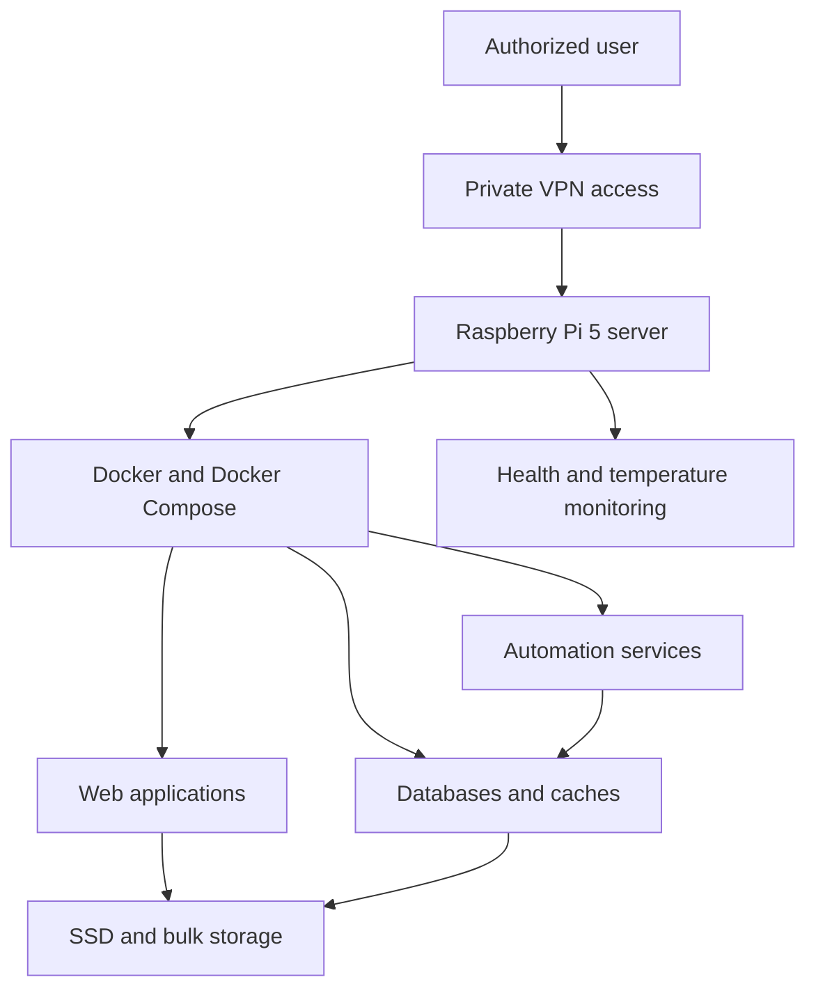

# Server Infrastructure Report

**Last audited:** October 5, 2026  
**Purpose:** Simple, public-safe overview of the server used for self-hosting and application deployment.

> This report intentionally excludes IP addresses, hostnames, usernames, credentials, device identifiers, private paths, and externally exposed ports.

## 1. Overview

The server is a **Raspberry Pi 5** running Ubuntu Server. It acts as a small, energy-efficient self-hosting platform for containerized applications, automation tools, storage services, and development projects.

Most applications run as Docker containers. Remote administration is performed through a private VPN instead of directly exposing administrative services to the public internet.

## 2. Current Audit Snapshot

| Check | Status |
| --- | --- |
| Docker service | Active |
| Private VPN service | Active |
| Remote administration service | Active |
| SSD temperature monitor | Active |
| Running containers | 19 |
| Container health | All observed containers running; configured health checks reported healthy |
| System SSD usage | 29% used |
| Operating-system updates | Updates are pending review |

The audit found the main hosting services operational. Pending operating-system updates should be reviewed and installed during a maintenance window.

## 3. Hardware

| Component | Specification |
| --- | --- |
| Server | Raspberry Pi 5 Model B |
| Processor | 4-core ARM64 CPU |
| Memory | 8 GB RAM |
| System storage | Approximately 256 GB SSD, ext4 |
| Additional storage | Approximately 500 GB HDD, NTFS |
| Architecture | `aarch64` / ARM64 |

At the time of review, the system SSD had approximately **29% usage**, leaving enough space for application images, logs, updates, and normal operation.

## 4. Operating System and Platform

| Software | Version or role |
| --- | --- |
| Operating system | Ubuntu 24.04.4 LTS |
| Kernel | Linux 6.8.0 Raspberry Pi build |
| Container engine | Docker 29.8 |
| Container definitions | Docker Compose 5.5 |
| Private networking | Tailscale |
| Remote administration | SSH over a private network |

The long-term-support operating system provides security updates and a stable base for self-hosted workloads.

## 5. Architecture



## 6. Hosted Workload Groups

The server had **19 running containers** during this audit. They are organized into the following general groups:

| Group | Purpose |
| --- | --- |
| Web applications | Browser-accessible self-hosted tools and dashboards |
| Media services | Media library management, indexing, and playback |
| Photo management | Private photo storage, processing, and search |
| Automation | Workflow execution and task automation |
| Databases | Persistent PostgreSQL databases for applications |
| Cache and queues | Fast temporary data storage for application workloads |
| File synchronization | Synchronization between approved devices |
| Credential management | Private self-hosted password-vault service |
| Monitoring | Storage-temperature monitoring and basic service health checks |

Each application is placed in its own container or Compose stack where practical. This reduces dependency conflicts and makes applications easier to update, restart, or remove independently.

## 7. Attendance Manager Deployment

The **Etlab Attendance Manager** can run as a separate Flask and Gunicorn workload on this infrastructure.

```text
Browser
   |
   v
Attendance Manager container
   |
   +--> Etlab portal over HTTPS
```

Recommended deployment practices:

- Build the application using its provided `Dockerfile`.
- Start it using Docker Compose.
- Store `ETLAB_TOKEN_SECRET` in a protected environment file or secret manager.
- Do not commit passwords, cookies, signing keys, or `.env` files.
- Keep the application behind a trusted private network or a properly configured HTTPS reverse proxy.
- Persist only data that genuinely needs to survive container replacement.

## 8. Storage Strategy

The server uses two storage classes:

1. **System SSD** — operating system, Docker engine, application configuration, and frequently accessed data.
2. **Bulk HDD** — larger files that do not require SSD-level performance.

Container configuration and application databases should be backed up separately from large replaceable files. A backup is only considered valid after its restoration process has been tested.

## 9. Networking and Security

The infrastructure follows these basic security principles:

- Administrative access is routed through a private VPN.
- Public port exposure should be avoided unless it is required and reviewed.
- Application credentials are stored outside Git repositories.
- Containers use separate Docker networks where practical.
- Services should run with the minimum permissions they need.
- Operating-system and container-image updates should be applied regularly.
- A default-deny host firewall policy should be enabled and reviewed before exposing any service publicly.
- HTTPS should protect any application available outside the private network.

## 10. Monitoring and Maintenance

The SSD-temperature monitor was active during this audit. Docker health checks were also reporting healthy status for containers that define them.

Routine maintenance includes:

- Review storage usage and disk health.
- Check container health and restart loops.
- Review and install pending Ubuntu security updates.
- Update container images carefully and review breaking changes.
- Back up application configuration and databases.
- Test restoration procedures periodically.
- Remove unused images, containers, and volumes after confirming they are no longer needed.
- Review the host firewall policy before changing network exposure.

## 11. Design Goals

The infrastructure is designed to be:

- **Simple:** applications are primarily managed with Docker Compose.
- **Private:** administrative access stays on a trusted private network.
- **Portable:** containerized workloads can be recreated on another Linux host.
- **Maintainable:** services are separated into independent stacks.
- **Cost-efficient:** the Raspberry Pi provides low-power, always-on operation.

## 12. Limitations

This is a compact personal server rather than a high-availability production cluster. A hardware failure or host restart can temporarily stop all services. Important data therefore requires tested backups, and critical services should not depend on this single machine without an appropriate recovery plan.
